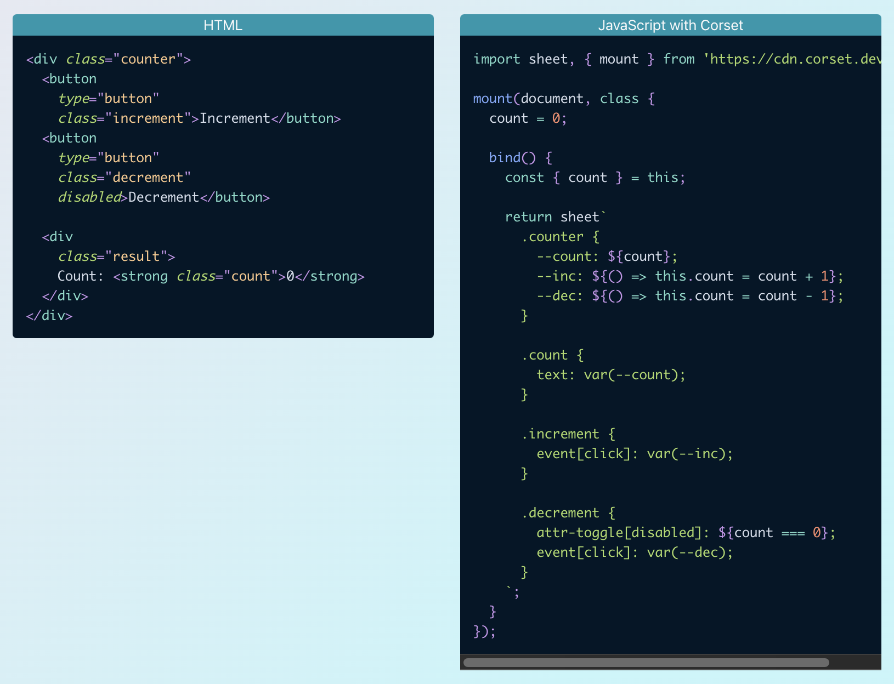
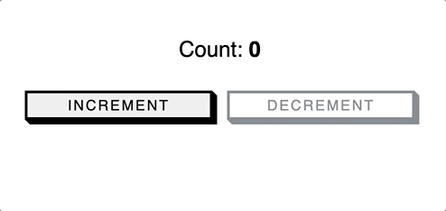

# Interesting Round-Up 24 Mar 2022
_Weekly / Biweekly updates on stuffs I found funny / interesting in Web Platform-related stuffs (that still potential to be explored in day-to-day)!_
_____

## Corset   
This might be the weirdest thing you'll see today, but really worth to explore since they claim to be fast and the way I see it, it is... 
Just, currently might be limited to templating to create the backend (you can use React to create the template fyi, then outputs unreactive React).
Good for exploration in internal app.

Corset is enabling reactivity of an HTML by connecting to it with CSS-like DSL. Not getting it? OK... See this image 👇🏻

Mind blown...

## Stiches  
Stiches is already a well known CSS-in-JS library with almost near zero-runtime. This styling library was explored by UNIFY team, however you may take a spin and see if we can utilize this in Tokopedia Lite. If not, at least you learned something new (and fun).
[Why choosing Stitches over Emotion and how to migrate](https://stitches.dev/blog/migrating-from-emotion-to-stitches).

## FAQ Schema 
This is just a reminder that you can enrich your page's Google's result with FAQ Schema if you have FAQ on them. Implement them if you can so that your customers will have easier time geting information and contexts from your page. Read them [here](https://developers.google.com/search/docs/advanced/structured-data/faqpage).

## Chrome Extension CLI 
After being in version 0.x.x for a pretty long time, Chrome Extension CLI has released it's 1.0.0 version! If you want to create Chrome Extension, this is the easiest way not to create messy stuffs.

## Stripe's Success Story: Migrating 3.5M LOC from Flow to TypeScript  
Stripe team uses a codemod to migrate their existing codebase from Flow to TypeScript over the weekend.
https://twitter.com/alunny/status/1501261144341680130
During the process, the team disables TS errors for the time being, as the most important thing is to get things running.
This is what we can say as start "shipping" early, then iterate.

_please skip the `we're hiring!` part_ 🥲

